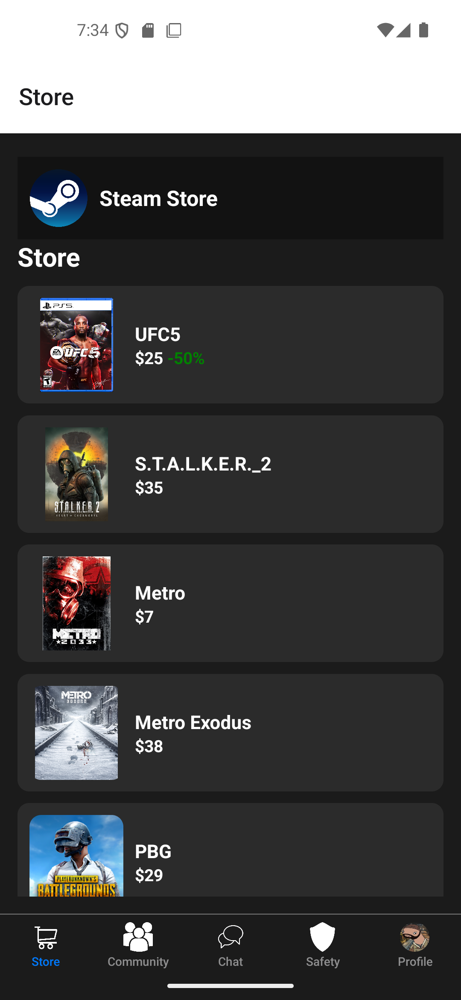
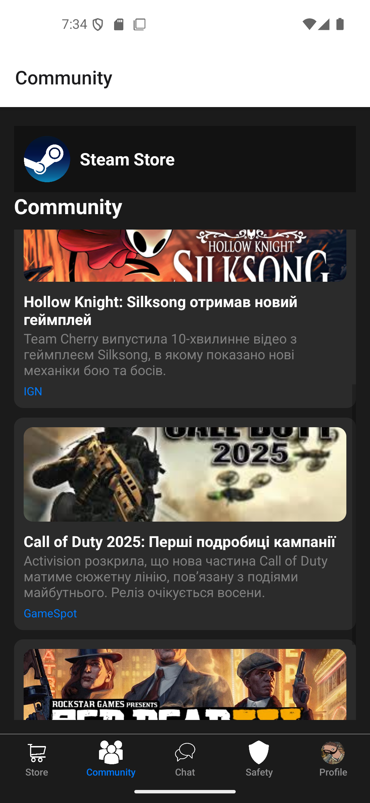
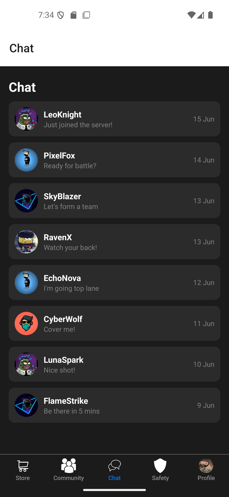
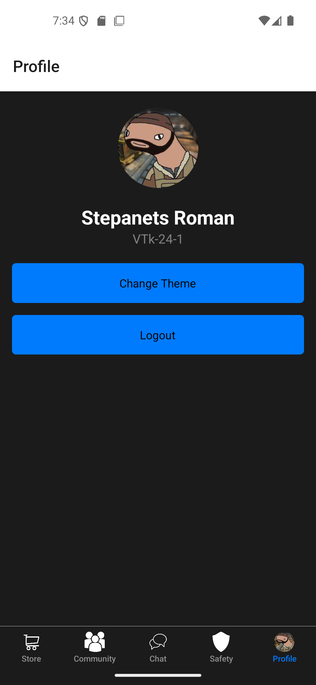
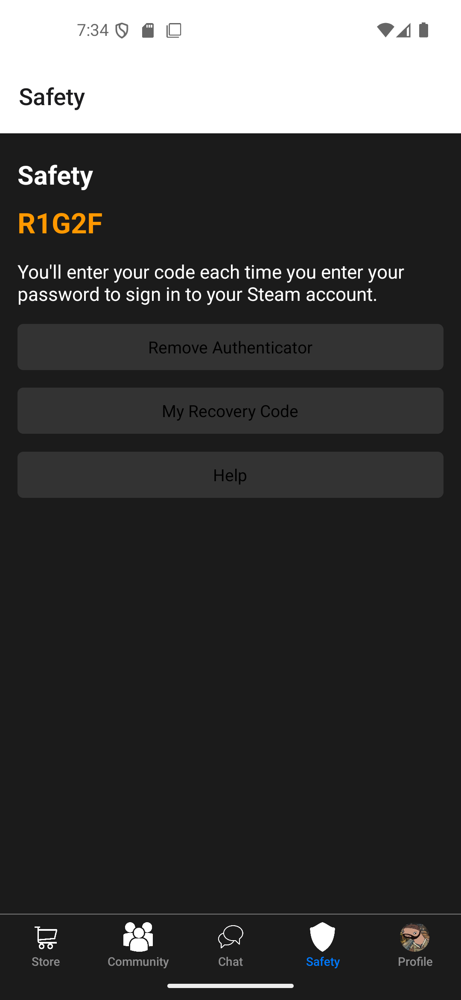

# Steam Store App

Цей проект — мобільний додаток, створений за допомогою React Native. Додаток надає можливість переглядати магазин ігор, спільноту, чат, профіль та систему безпеки.

## Опис

Steam Store App реалізує такі функції:
- **Магазин**: відображення списку ігор із цінами та знижками.
- **Спільнота**: перегляд новин, пов'язаних з іграми.
- **Чат**: список контактів із можливістю перегляду повідомлень.
- **Безпека**: система двофакторної автентифікації з кодом.
- **Профіль**: відображення користувацьких даних та можливість зміни теми або виходу з акаунту.

## Вимоги до запуску

Для запуску додатка потрібно мати:
- **Node.js** — для керування пакетами та запуску React Native.
- **React Native CLI** — для побудови та запуску додатка.
- **Android Studio** — для запуску додатка на емуляторі або реальному пристрої.

## Необхідні імпорти

Для цього проекту необхідно імпортувати наступні бібліотеки:

```js
import React, { Component } from "react";
import { View, Text, FlatList, Image, StyleSheet, TouchableOpacity, TextInput } from "react-native";
import { NavigationContainer } from "@react-navigation/native";
import { createBottomTabNavigator } from '@react-navigation/bottom-tabs';
```

## Скриншоти







## Автор

- **Степанець Роман Степанович**, студент групи ВТк-24-1.

