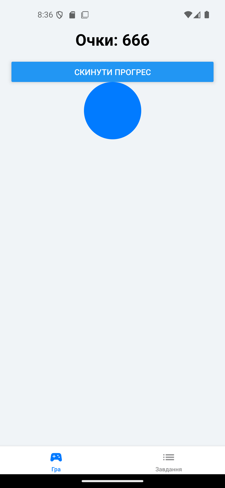
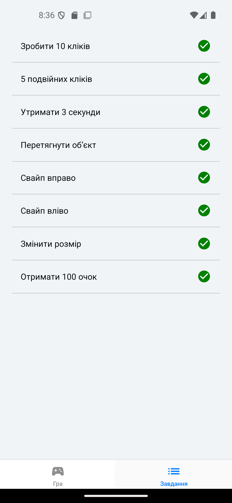

# Лабораторна робота №3

## Тема: Використання жестів у React Native за допомогою `react-native-gesture-handler`.

### Опис:
У цій лабораторній роботі створено мобільний додаток – гру-клікер, що використовує різні жести для взаємодії з користувачем. Додаток дозволяє користувачам виконувати завдання за допомогою жестів, таких як натискання, подвійне натискання, довге натискання, перетягування, свайпи, і масштабування. Завдання виконуються для набрання очок.

---

## Структура додатка:
Додаток складається з двох основних екранів:
1. **Гра (GameScreen)** — на цьому екрані користувач виконує різні жести для заробітку очок.
2. **Завдання (TasksScreen)** — на цьому екрані користувач може переглянути список завдань, які потрібно виконати для досягнення певних результатів.

---

## Екрани:

### 1. Гра (GameScreen)
Цей екран є основним для гри-клікера, де користувач може взаємодіяти з додатком за допомогою різних жестів, щоб заробляти очки і виконувати завдання. 

На екрані зображено кругле коло, яке користувач може натискати, утримувати, перетягувати.

#### Фото GameScreen:

---

### 2. Завдання (TasksScreen)
Цей екран показує список завдань, які користувач має виконати для досягнення певних результатів. Кожне завдання перевіряється, і при його виконанні відображається галочка.

- **Tap Gesture**: Один клік збільшує очки на 1.
- **Double Tap**: Подвійне натискання збільшує очки на 2.
- **Long Press**: Утримання елемента більше 3 секунд додає 5 очок.
- **Pan Gesture**: Перетягування елемента додає 3 очки.
- **Fling Gesture**: Свайп у різні сторони дозволяє переходити між екранами.
- **Pinch Gesture**: Масштабування додає 7 очок.

#### Фото TasksScreen:

---

## Використані технології:
- React Native
- react-native-gesture-handler
- react-navigation для навігації між екранами
- react-native-vector-icons для іконок

---

## Автор

- **Степанець Роман Степанович**, студент групи ВТк-24-1.